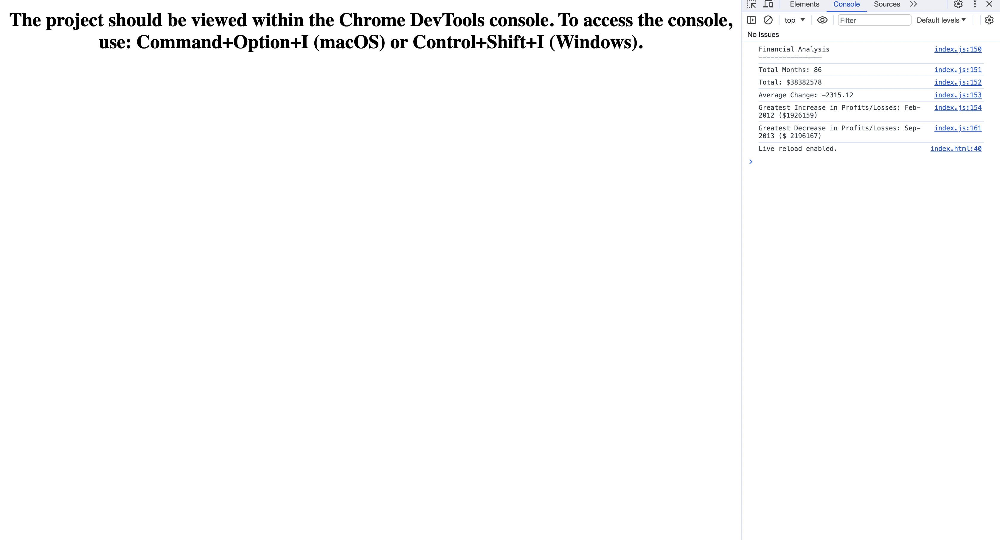

# Console Finances (Module 4 Challenge)
My submission for the Module 4 Console Finances JavaScript challenge

## Description

This is a my submission for the Module 4 Console Finances challenge. The challenge was to create a console-based financial application to process a provided dataset and achieve some pre-determined outputs (see screenshot).

## Installation

The project should be viewed within the Chrome DevTools console. To access the console, use: Command+Option+I (macOS) or Control+Shift+I (Windows).

## Usage

The webpage can be accessed via the following url: https://jonathon10k.github.io/Console-Finances

## Credits

N/A

## License

N/A